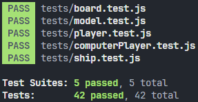

# Battleship

<p align = 'center'>
  
</p>

---

## Description

This is a web-based implementation of the battleship game against a randomly attacking AI.

The application's logic is developed test-first with JavaScript and Jest, and the interface is made using a combination of JavaScript and Tailwind CSS.

_Other tools used in this project include webpack, Babel, ESLint, and Prettier._

---

## Table of Contents

- [Installation](#installation)
- [Usage](#usage)
- [Features](#features)
- [Tests](#tests)
- [Reflections](#reflections)

---

## Installation

There are a couple of ways to run the software:

1. The easier way is to visit the [online live preview](https://royojeda.github.io/battleship/).

2. The other option is to clone the repository to your own machine by running the following commands in the command line (you must have **Git** and **Node.js** installed):

   ```bash
   git clone git@github.com:royojeda/battleship.git
   ```

   and then run:

   ```bash
   cd battleship
   ```

   to enter the project directory, then:

   ```bash
   npm install
   ```

   to install the dependencies, and finally:

   ```bash
   npm start
   ```

   to run webpack's dev server.

---

## Usage

The user interface should look familiar if you've played a game of battleship in the past.

<p align = 'center'>
  
</p>

This is the setup phase, where the player is prompted to place ships on the board. Following the rules from [its Wikipedia page](<https://en.wikipedia.org/wiki/Battleship_(game)>), the player is given five ships that occupy five, four, three, three, and two squares, respectively. These ships can be placed either vertically or horizontally on a grid composed of ten by ten squares. The AI opponent places their ships in random locations with random orientations.

_Note: In this application, the ships' location and orientation cannot be changed after they are placed on the board._

<p align = 'center'>
  
</p>

After the setup phase, the player's board is shifted to the left, and another board is shown to the right. This represents the current status of the opponent's board from the perspective of the player and is where they place their attacks. The squares change colors from a default white to gray if an attack is a `miss`, or orange if it's a `hit`. When a ship is `sunk`, the color of the squares it occupies changes to red. The player's ships are shown in green.

Play continues until all the ships of at least one player are sunk at the end of a round, which is composed of both players' turns.

---

## Features

The application is made to handle some potentially bug-inducing cases.

- In the setup phase, players are prevented from placing a ship in locations where it will either go out of bounds or overlap with ships that are already on the grid. There are visual cues that communicate to the player whether or not the square that the cursor is hovering over is a valid location for the current ship with the current orientation.

- The player can rotate (or toggle) a ship's orientation by pressing the key `R` before placing it on the board. Doing so will also re-run the logic for checking whether the hovered-over square is a valid location for the ship that's currently being placed.

- After the setup phase, the player isn't allowed to make any changes to their own board.

- Players are not allowed to attack a square that's already been attacked. The AI opponent is also designed to not include already-attacked squares when choosing its next random attack.

- After a game ends, the player can choose to play another one, starting again from the setup phase. The previous game or games should not have any effect on the current game.

- Draws are recognized and reported as such by the application. Draws are possible because, by design, the win condition is only checked after every round, when both players have finished their turn. This behavior conforms to the aforementioned rules of the game.

---

## Tests

I made an effort to implement a Model-View-Controller structure for this project, where the logic in the model is developed test-first. These tests are written using **Jest** and can be run by executing:

```bash
npm test
```

in the terminal.

<p align = 'left'>
  
</p>

---

## Reflections

I feel more comfortable writing unit tests and doing test-driven development. Maybe this can be attributed to my having written tests in two different languages now. I still follow Sandi Metz's unit testing guidelines in trying to write high-quality tests for classes' behavior instead of implementation and avoiding redundant tests for the sake of having more tests.

I also had the opportunity to use the `async/await` syntax in this project, specifically when the application needs to wait for the player's actions.

This is my final JavaScript project that aims to use only plain JavaScript without component libraries. At the time of this writing, I am currently working on another game, this time using React. Battleship (among other projects) has given me a greater understanding of the language and confidence in tackling all these other tools moving forward.
